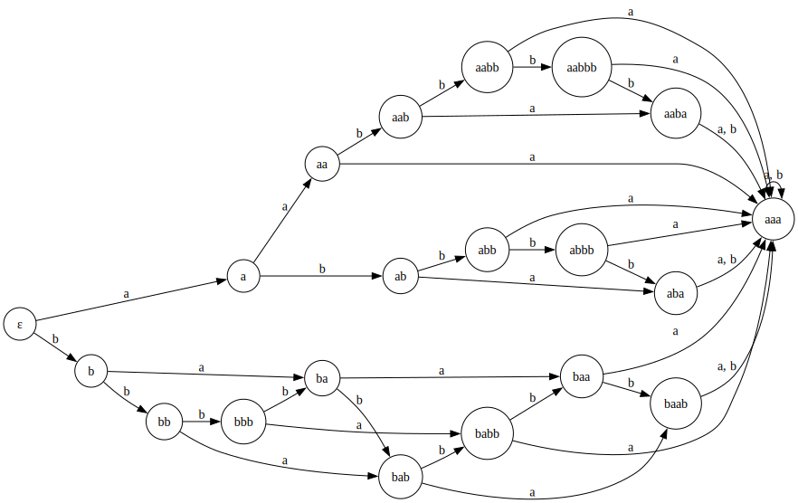

# Лабораторная работа №1
Дана SRS $\tau$:

$$
abbaba \rightarrow aabbbaa \\
$$
$$
aaa \rightarrow abab \\
$$
$$
abba \rightarrow baaab \\ 
$$
$$
bbbb \rightarrow ba \\
$$

## Завершимость 
Данная SRS незавершима. Пример: 

$$
w_1 abbaa w_2
$$
$$
w_1 baaaba w_2
$$
$$
w_1 bababba w_2
$$
$$
w_1 babbaaab w_2
$$
$$
w'_1 abbaa w'_2
$$

Где $w'_1 > w_1$ и $w'_2 > w_2$. Мы получили бесконечный цикл.

## Классы эквивалентности
### Конечность классов эквивалентности по НФ
Заметим, что если слева стоит $b$,  то вся строка приводитя к виду $b^n$. Следовательно, нужно рассмотреть два набора:
1. набор, где невозможно привести $b$ влево;
2. последовательности $b^n$.

Рассмотрим первый набор:

$$a, aa, ab, aab, aba, abb, aaba, aabb, abbb, aabbb$$

Следует обратить внимание на $aaa$:

$$aaa \leftrightarrow abab \leftrightarrow ab^5 \leftrightarrow abba \leftrightarrow baaab \leftrightarrow bababb \leftrightarrow b^{10} \leftrightarrow b^6ba \leftrightarrow b^3baa \leftrightarrow baaa$$

Таким образом, мы получаем 

$$aaa \leftrightarrow baaa$$

$$aaa \leftrightarrow b^{10}$$

Аналогично, 

$$aaaa \leftrightarrow ababa \leftrightarrow ab^5a \leftrightarrow abbaa \leftrightarrow baaaba \leftrightarrow bababba \leftrightarrow b^{13} \leftrightarrow b^3aaa \leftrightarrow aaa$$

То есть, 

$$aaa \leftrightarrow aaaa$$

Рассмотрим второй набор:

1. $b$
2. $bb$
3. $bbb$
4. $$bbbb \leftrightarrow ba$$
5. $$bbbbb \leftrightarrow bab$$
6. $$bbbbbb \leftrightarrow babb$$
7. $$b^7 \leftrightarrow b^4a \leftrightarrow baa $$
8. $$b^8 \leftrightarrow baab $$
9. $$b^9 \leftrightarrow b^4b^4b \leftrightarrow babab \leftrightarrow baaa \leftrightarrow aaa $$
10. $$b^{10} \leftrightarrow baaa \leftrightarrow aaa $$

При $$n \geq 9$$  $$b^n \leftrightarrow  aaa$$.

Мы получаем классы эквивалентности: $$\epsilon, a, aa, ab, aab, aba, abb, aaba, aabb, abbb, aabbb, b, bb, bbb, ba, bab, babb, baa, baab, aaa$$.

### Построение ДКА
Для наглядности построим ДКА по данным классам эквивалентности.
